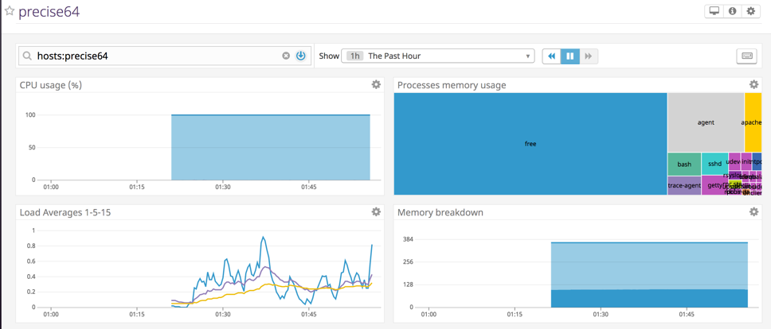
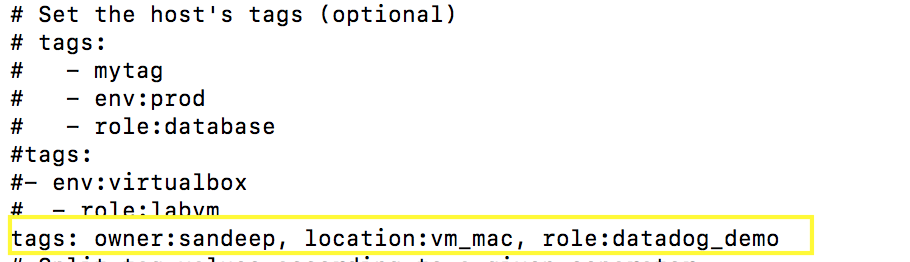

# Environment Setup
Vagrant was installed as per the instructions with Virtualbox Ubuntu 12.04. 
It took less than a minute for DataDog agent to be installed and running. Within few minutes it began reporting data to SaaS based UI. Screenshot included in section below. 

All system and OS level metrics such as CPU, Memory, Processes, Disk, Network were being reported OTB.

## Vagrant Version
sparmar-mac:~ sandeepparmar$ vagrant -v

Vagrant 2.2.0

## Virtual Box
sparmar-mac:~ sandeepparmar$ vagrant box list

hashicorp/precise64 (virtualbox, 1.1.0)

## Operating System
vagrant@precise64:~$ cat /proc/version

Linux version 3.2.0-23-generic (buildd@crested) (gcc version 4.6.3 (Ubuntu/Linaro 4.6.3-1ubuntu4) ) #36-Ubuntu SMP Tue Apr 10 20:39:51 UTC 2012

## Datadog Agent Status

vagrant@precise64:~$ datadog-agent status 

datadog-agent start/running, process 2648

Below is screenshot that shows metrics reported by agent in UI

# Collecting Metrics

## Adding Tags in Agent Config
Tags are popular mechanism to manage Configuration Items at scale. All the layers of technology today from Physical to App have capabilities of adding Tags to instances so that they can be easily categorized and managed. 

In Datadog agent, it was very simple to locate datadog.yaml in Conf.d directory  and configure tags for the VM. Tags I created – owner, location and role with format highlighted in image below. I had to restart agent to populate the tags in UI as they didn’t appear at first. 

* Screenshot for datadog.yaml changes:

  
 
  
 

  
  

 
