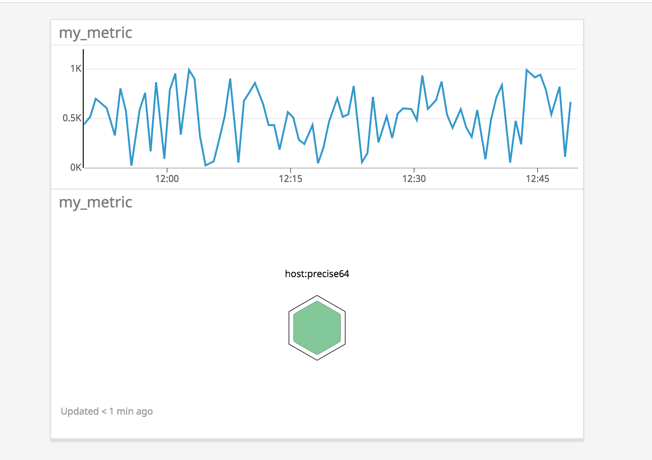

# 1. Environment Setup
Vagrant was installed as per the instructions with Virtualbox Ubuntu 12.04. 
It took less than a minute for DataDog agent to be installed and running. Within few minutes it began reporting data to SaaS based UI. Screenshot included in section below. 

All system and OS level metrics such as CPU, Memory, Processes, Disk, Network were being reported OTB.

## 1.1 Vagrant Version
sparmar-mac:~ sandeepparmar$ vagrant -v

Vagrant 2.2.0

## 1.2 Virtual Box
sparmar-mac:~ sandeepparmar$ vagrant box list

hashicorp/precise64 (virtualbox, 1.1.0)

## 1.3 Operating System
vagrant@precise64:~$ cat /proc/version

Linux version 3.2.0-23-generic (buildd@crested) (gcc version 4.6.3 (Ubuntu/Linaro 4.6.3-1ubuntu4) ) #36-Ubuntu SMP Tue Apr 10 20:39:51 UTC 2012

## 1.4 Datadog Agent Status

vagrant@precise64:~$ datadog-agent status 

datadog-agent start/running, process 2648

* Below is screenshot that shows metrics reported by agent in UI

  


# 2. Collecting Metrics

## 2.1 Adding Tags in Agent Config
Tags are popular mechanism to manage Configuration Items at scale. All the layers of technology today from Physical to App have capabilities of adding Tags to instances so that they can be easily categorized and managed. 

In Datadog agent, it was very simple to locate datadog.yaml in Conf.d directory  and configure tags for the VM. Tags I created – owner, location and role with format highlighted in image below. I had to restart agent to populate the tags in UI as they didn’t appear at first. 

* Screenshot for datadog.yaml changes:

  
  
* Here is the screenshot with all the tags listed for monitored host

  
  
  
## 2.2 MySQL Integration

In this section I learned how to collect metrics/monitor for a database. It was a simple configuration to build mysql.yaml file in conf.d directory of the datadog agent (Screenshot below).

Value I see in the metrics is that we are able to collect OS, System and now DB level metrics all via single agent with minimal effort. Not only that, but custom metrics can be defined to look at specific aspect of the target. 

* Here is the screenshot of the config file
  
  
  
* Dashboard below shows several metrics captured out of the box. My favorite for any database is slow queries and reads and writes per sec. These give a very good idea on load and performance for a database. Further it can be correlated back with guest OS Disk I/O metrics and Host to identify root cause for performance.

  
  
## 2.3 Custom Agent Check

This section helped understanding building a custom monitor for a particular target metric. Most of the Enterprise teams have requirements to measure such metrics for a custom application or any other unique source they have in their environment. I found it very simple to configure and consume vs. experience I had in some other products in past. I really liked the datadog agent architecture because it simplifies a lot of upfront config and troubleshooting syntax error is fairly simple. I got to know where exactly my error is and fixed a couple of them in matter of few minutes before I got it working. Following command helped locate error in check. 

* dd-agent datadog-agent check <CHECK_NAME>

* Check(.py)
```python
import random
from checks import AgentCheck
class HelloCheck(AgentCheck):
      def check(self, instance):
          self.gauge('my_metric', random.randint(1,1000))
```
* Check.yaml

    init_config:
  
    instances:
  
      - min_collection_interval: 45
      
* Below is the screenshot for Custom Metric in UI
  
  
  
### Bonus Question 1
Can you change the collection interval without modifying the Python check file you created?

Answer: Yes, by defining “min_collection_interval” in conf.d / corresponding .yaml file

# 3. Visualizng Data

## 3.1 Custom Metric scoped over host

* Simply built New Timeboard to include time series dashboard and host-map graphs

  
  
## 3.2 Anomaly function applied to SQL Metric

* Anomaly function allows to detect outliers for a metric. There are three type of algorithms available to use – Basic, Agile and Robust which gives flexibility based on type of metric. In following dashboards base algorithm is used.

  
  
## 3.3. Custom Metric with Roll-up function applied (Sum, 1 hr)

* Rollup function is perfect to summarize metrics over a longer period of time. It takes multiple raw values and shows sum/min/max/count/avg of those values. Metrics such as #users online is a good example where we can use count parameter over a period of time to trend #users.

  
  
## 3.4 Timeboard with 5 mins timeframe

   
  
  ### Bonus Question 2
  
  What is the Anomaly graph displaying? 
  
  Timeseries graph of metric mysql connections over a 24 hr window for host precise 64. The actual throughput is in purple; the gray band shows the anomaly detection algorithm's predicted range based on data from prior days. Red shows value the metric was not in expected range. 
  
# 4. Monitoring Data

This section was mainly around communication and collaboration capabilities that Datadog provides. Taking snapshot and tagging other users to share is a great feature plus integration with collaboration platform such as slack is a big plus. I was amazed how smoothly all these functions work. 

## 4.1 Threshold & Alerts

Following is an e.g. where I took a custom metric and applied threshold. All the parameters pop -up automatically as you write message logic. Again, both simplified and still highly flexible is the key take away. 

  
  
  
  
  * Email Notification arrived in my Inbox as soon as warning threshold was breached
  
  
  
### Bonus Question 3 - Downtime Management

Downtime configuration is critical to suppress noise and keep adoption level high for a monitoring platform. Highly configurable and yet straightforward was my experience while configuring this. UI is was fast although load was negligible as I monitored only two hosts.

  
  
  
  
  Email Notification arrived for both new and configuration change. 
  
  
  
  
# 5. Collecting APM Data

So far, we covered Host, OS, System, Disk, Network and Database level metrics. In this section I learned about APM capabilities of Datadog platform. Having worked on other APM products such as AppDynamics and Dynatrace, I can tell that comparatively it was simpler to turn on APM and instrumentation. There isn’t a separate agent for each set of metrics except MacOS which I believe will be consolidated in upcoming release. 

You don’t need to be a coder to instrument the app. I used one command that wrapped ddtrace-run function around the flask app and within few minutes data populated in UI. 

I am not sure if this was done on purpose but to run newer version of PIP is required however the Ubuntu image and virtualenv package are shipped with version 1.0 which connects to http instead of https library and won’t upgrade either. I ended up uses PIP that came with datadog agent. But I couldn’t use virtualenv because of this limitation, I am sure there are other ways to get around this. But that is again environment/setup thing and has nothing to do with datadog . 

* Instrument flask application 

  
  

* Service Dashboard shows all the apps monitored via APM and you can drill down to see more details. 

  
  
* Here are Service Metrics captured OTB. Custom instrumentation will allow more deep-dive visibility especially for custom applications where auto-instrumentation is not available. 

  
  
* 404 error code was captured on Flask.request method which is typically a misconfiguration for an object on front end. 

  
  
  ### Bonus Question 4
  
  Difference between a Service and a Resource
  
  A Service is set of processes/instructions that do the same job. For e.g. an application may contain several services such as web server service, logic service and a database service. In more complex environment number of services can go even higher. 
  
  A Resource is an action for a service. As an e.g. for MySQL database service, a resource is the query itself. 
  
# 6. Final Question

Is there anything creative you would use Datadog for?

I am big fan and user of home automation products – auto door locks, garage opener, lights, sprinkler system, security cameras, smart thermostats, etc. As number of automation devices increases, managing automation itself become challenging. There are already 10+ apps that I am using to manage entire automation. App used for system security is separate than managing sprinkler systems and so on. It would be great to be alerted when my door is unlocked, and motion is detected in security camera in same platform/app. Datadog is surely capable of integrating with all these platforms through API’s to get information required to generate alert. And of course, entire family can install one app and be on same page. That itself is a big help!!

Another area where I see application of Datadog is for monitoring cloud bills for large Enterprises. Business units in Enterprise are accelerating application migration to cloud, however, keeping an eye on cloud spend is critical as OpEx can shoot up very quickly in Public Clouds. Dev and business users can monitor their cloud spending via API call. 


  


   
   
  


     


  
  
  
  


  
  
 
  
 


  
  


 
