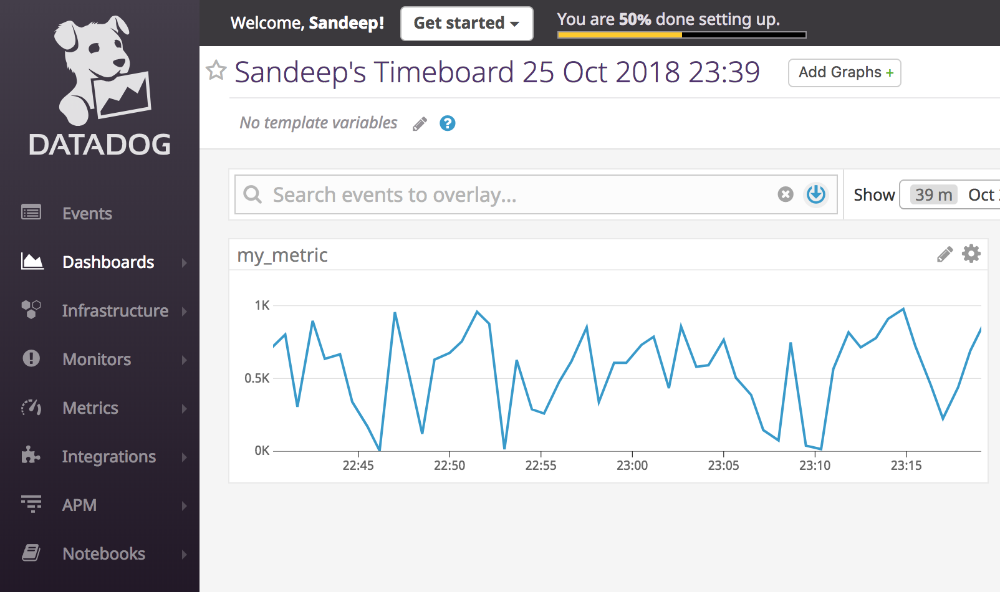

# Environment Setup
Vagrant was installed as per the instructions with Virtualbox Ubuntu 12.04. 
It took less than a minute for DataDog agent to be installed and running. Within few minutes it began reporting data to SaaS based UI. Screenshot included in section below. 

All system and OS level metrics such as CPU, Memory, Processes, Disk, Network were being reported OTB.

## Vagrant Version
sparmar-mac:~ sandeepparmar$ vagrant -v

Vagrant 2.2.0

## Virtual Box
sparmar-mac:~ sandeepparmar$ vagrant box list

hashicorp/precise64 (virtualbox, 1.1.0)

## Operating System
vagrant@precise64:~$ cat /proc/version

Linux version 3.2.0-23-generic (buildd@crested) (gcc version 4.6.3 (Ubuntu/Linaro 4.6.3-1ubuntu4) ) #36-Ubuntu SMP Tue Apr 10 20:39:51 UTC 2012

## Datadog Agent Status

vagrant@precise64:~$ datadog-agent status 

datadog-agent start/running, process 2648

* Below is screenshot that shows metrics reported by agent in UI

  


# Collecting Metrics

## Adding Tags in Agent Config
Tags are popular mechanism to manage Configuration Items at scale. All the layers of technology today from Physical to App have capabilities of adding Tags to instances so that they can be easily categorized and managed. 

In Datadog agent, it was very simple to locate datadog.yaml in Conf.d directory  and configure tags for the VM. Tags I created – owner, location and role with format highlighted in image below. I had to restart agent to populate the tags in UI as they didn’t appear at first. 

* Screenshot for datadog.yaml changes:

  
  
* Here is the screenshot with all the tags listed for monitored host

  
  
  
## MySQL Integration

In this section I learned how to collect metrics/monitor for a database. It was a simple configuration to build mysql.yaml file in conf.d directory of the datadog agent (Screenshot below).

Value I see in the metrics is that we are able to collect OS, System and now DB level metrics all via single agent with minimal effort. Not only that, but custom metrics can be defined to look at specific aspect of the target. 

* Here is the screenshot of the config file
  
  
  
* Dashboard below shows several metrics captured out of the box. My favorite for any database is slow queries and reads and writes per sec. These give a very good idea on load and performance for a database. Further it can be correlated back with guest OS Disk I/O metrics and Host to identify root cause for performance.

  
  
## Custom Agent Check

This section helped understanding building a custom monitor for a particular target metric. Most of the Enterprise teams have requirements to measure such metrics for a custom application or any other unique source they have in their environment. I found it very simple to configure and consume vs. experience I had in some other products in past. I really liked the datadog agent architecture because it simplifies a lot of upfront config and troubleshooting syntax error is fairly simple. I got to know where exactly my error is and fixed a couple of them in matter of few minutes before I got it working. Following command helped locate error in check. 

* dd-agent datadog-agent check <CHECK_NAME>

* Check(.py)
```python
import random
from checks import AgentCheck
class HelloCheck(AgentCheck):
      def check(self, instance):
          self.gauge('my_metric', random.randint(1,1000))
```
* Check.yaml

    init_config:
  
    instances:
  
      - min_collection_interval: 45
      
* Below is the screenshot for Custom Metric in UI
  
  
  
### Bonus Question
Can you change the collection interval without modifying the Python check file you created?

Answer: Yes, by defining “min_collection_interval” in conf.d / corresponding .yaml file

# Visualizaing Data

## Custom Metric scoped over host

* Simply built New Timeboard to include time series dashboard and host-map graphs

  
  
## Anomaly function applied to SQL Metric

* Anomaly function allows to detect outliers for a metric. There are three type of algorithms available to use – Basic, Agile and Robust which gives flexibility based on type of metric. In following dashboards base algorithm is used.

  
  
## Custom Metric with Roll-up function applied (Sum, 1 hr)

* Rollup function is perfect to summarize metrics over a longer period of time. It takes multiple raw values and shows sum/min/max/count/avg of those values. Metrics such as #users online is a good example where we can use count parameter over a period of time to trend #users.

  
  
## Timeboard with 5 mins timeframe

   
  
# Monitoring Data

This section was mainly around communication and collaboration capabilities that Datadog provides. Taking snapshot and tagging other users to share is a great feature plus integration with collaboration platform such as slack is a big plus. I was amazed how smoothly all these functions work. 

## Threshold

Following is an e.g. where I took a custom metric and applied threshold. All the parameters pop -up automatically as you write message logic. Again, both simplified and still highly flexible is the key take away. 

  
  
  
  
  


   
   
  


     


  
  
  
  


  
  
 
  
 


  
  


 
